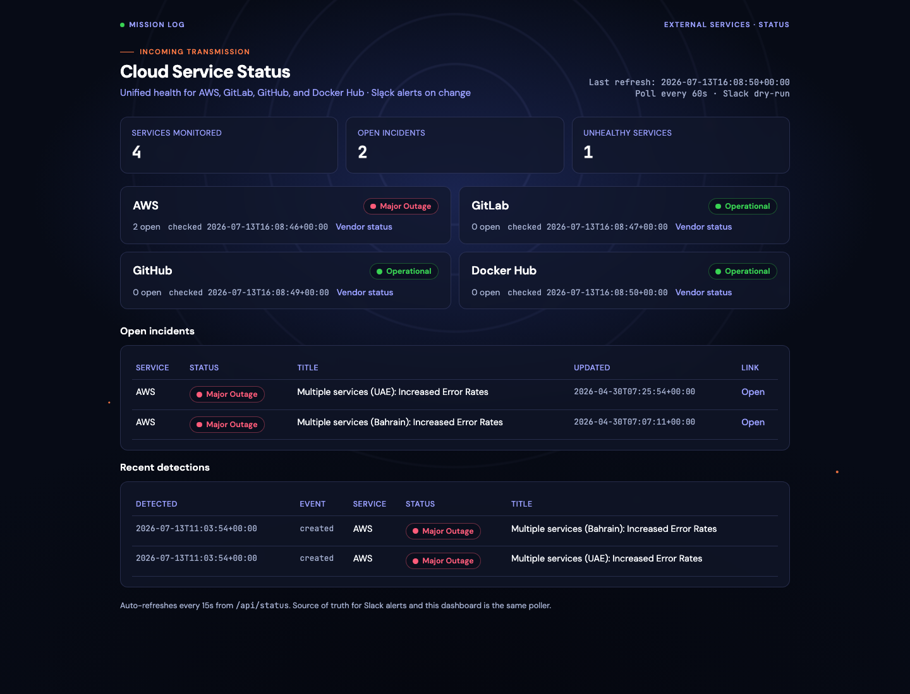

# Cloud Service Status Monitor

Unified dashboard and Slack alerting for critical external cloud dependencies.



## What it monitors

| Service | Provider | Source |
|---|---|---|
| AWS | `aws_health` | `https://health.aws.amazon.com/public/currentevents` |
| GitLab | `statusio` | `https://api.status.io/1.0/status/<page_id>` |
| GitHub | `statuspage` | `https://www.githubstatus.com/api/v2/...` |
| Docker Hub | `statusio` | `https://api.status.io/1.0/status/<page_id>` |

Providers are pluggable. Adding Cloudflare, Atlassian, etc. is usually a config entry when they use Statuspage.io or Status.io.

## Features

- **Unified dashboard** for AWS, GitLab, GitHub, and Docker Hub health
- Polls vendor status APIs on a configurable interval (default: 60s in dashboard mode)
- Detects new incidents, updates, and recoveries
- Sends Slack notifications with service name, status, title, timestamp, and status-page link
- Deduplicates alerts using persistent incident state
- Audit trail (`incident_audit.jsonl`) for reporting/troubleshooting

## Quick start (local)

```bash
cd cloud-service-status-monitor
make install
export SLACK_WEBHOOK_URL="https://hooks.slack.com/services/..."

make seed      # baseline current open incidents without alerting
make serve     # live dashboard + Slack alerts (needs SLACK_WEBHOOK_URL)
make dry-run   # test polling without posting to Slack
```

Open the dashboard:

```bash
# production-like local run with real Slack delivery
.venv/bin/python -m cloud_status_monitor --config config/config.yaml --serve
```

One-shot / loop without UI:

```bash
make dry-run
make run
.venv/bin/python -m cloud_status_monitor --config config/config.yaml --loop
```

## Dashboard

The dashboard is served by `--serve` and auto-refreshes every 15 seconds.

- `/` — unified status UI
- `/api/status` — JSON for services, open incidents, recent detections
- `/healthz` — readiness/liveness probe

## Configuration

See [`config/config.yaml`](config/config.yaml).

Important environment variables:

- `SLACK_WEBHOOK_URL` — Incoming webhook URL
- `STATE_DIR` — Directory for state / audit / latest dashboard snapshot
- `DRY_RUN` — `true` to skip Slack delivery
- `POLL_INTERVAL_SECONDS` — Background poll interval for `--serve` / `--loop`

## Docker Compose

Compose has **no CronJobs**. Use the always-on poller instead:

```bash
export SLACK_WEBHOOK_URL="https://hooks.slack.com/services/..."
docker compose up --build
# dashboard: http://localhost:8080
```

The container runs `--serve`, which starts a background thread that polls vendors every `POLL_INTERVAL_SECONDS` (default 60) and sends Slack alerts on changes. That replaces Kubernetes CronJob scheduling.

If you truly need cron-style one-shots on a host, use host crontab / Ofelia to run:

```bash
docker compose run --rm monitor --config /app/config/config.yaml
```

That is optional and usually worse than `--serve` (no dashboard, harder state handling).

## Kubernetes (Helm Deployment)

Default `mode: dashboard` installs a **Deployment** + Service + PVC. Polling runs in-process (no CronJob).

```bash
# Build/push image first, then:
kubectl create secret generic cloud-status-monitor-slack \
  --from-literal=webhook-url="$SLACK_WEBHOOK_URL"

helm upgrade --install cloud-status \
  ./charts/cloud-service-status-monitor \
  --set image.repository=YOUR_REGISTRY/cloud-service-status-monitor \
  --set image.tag=1.0.0

# Open the dashboard
kubectl port-forward svc/cloud-status-cloud-service-status-monitor 8080:80
# http://127.0.0.1:8080
```

Preview manifests:

```bash
make helm-template
```

Optional ingress:

```bash
helm upgrade --install cloud-status ./charts/cloud-service-status-monitor \
  --set dashboard.ingress.enabled=true \
  --set dashboard.ingress.host=cloud-status.example.com
```

Cron-only mode (no UI):

```bash
helm upgrade --install cloud-status ./charts/cloud-service-status-monitor \
  --set mode=cron
```

With `poll_interval_seconds: 60`, Slack alerts are sent within about one minute of a detected vendor status change.

## Extending to another vendor

Statuspage.io example:

```yaml
- name: Cloudflare
  provider: statuspage
  enabled: true
  status_page_url: https://www.cloudflarestatus.com
  base_url: https://www.cloudflarestatus.com
```

Status.io example:

```yaml
- name: Example
  provider: statusio
  enabled: true
  status_page_url: https://status.example.com
  page_id: "<statusio-page-id>"
  api_base: https://api.status.io
```

## Tests

```bash
make install
make test
```

## Architecture

```
Dashboard (--serve) / CronJob / --loop
    │
    ▼
StatusMonitor.run_once()
    ├── Provider.fetch() per service  → normalized Incident list
    ├── latest_status.json            → dashboard source of truth
    ├── StateStore.diff               → created / updated / recovered
    ├── Audit JSONL append
    └── SlackNotifier                 → Incoming Webhook
```

State files under `STATE_DIR`:

- `latest_status.json` — per-service dashboard snapshot
- `incident_state.json` — currently open incidents (dedup source of truth)
- `incident_audit.jsonl` — append-only history of detected changes
